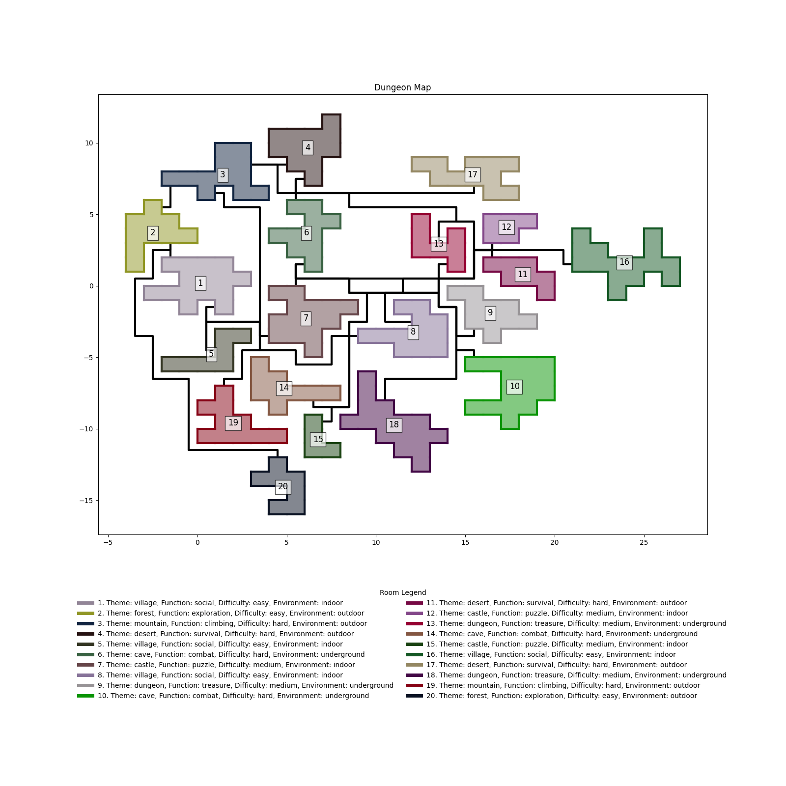

# pymap-dungeon-generator

Random map generator for video game prototyping and level design based on graph and optimization models.

## Sample Generated Dungeon

Below is an example of a dungeon generated using this project:



## About the Project

This project presents a random dungeon generator based on optimization models. It features:

- **Meta-room generation**: Rooms are generated with customizable meta-tags (e.g., themes, difficulty, environment).
- **Optimization with Maximum Spanning Tree (MST)**: Linear programming is used to calculate the MST of a complete graph, creating a logical and navigable dungeon structure.
- **Constraints and Zone Compatibility**: The system supports restrictions and compatibility between zones, promoting flexibility and creativity in procedural design.
- **2D and 3D Applicability**: While initially designed and tested for 2D environments, this approach can also be applied to 3D designs, enhancing its utility in modern game development.

This generator aims to facilitate rapid conceptual design of dungeons for video games, providing a powerful tool for prototyping and level design.

## Attribution

The code used in `pymap.py` to draw the dungeons is primarily based on the work of [Aliaksei Yaletski Tiendil](https://github.com/Tiendil/tutorial-dungeon-generation). It has been modified in this project to visualize the tree generated by the optimization model.

## Usage

To use the project:

1. Navigate to the project folder.
2. Run the following command:

   ```bash
   python3 pymap.py -r [number of rooms]
   ```

   Replace `[number of rooms]` with the desired number of rooms in the dungeon.

3. For more parameters and options, run:

   ```bash
   python3 pymap.py --help
   ```

## Features

- **Graph-based Modeling**: Uses complete graphs to represent all possible room connections.
- **Optimization Techniques**: Employs mathematical optimization to create structured layouts.
- **Procedural Flexibility**: Supports a variety of room tags and constraints for tailored dungeon generation.
- **Rapid Prototyping**: Designed to quickly generate and visualize dungeon layouts for game development.

## License
This project is distributed under the BSD-3-Clause License. See `LICENSE` for more information.

